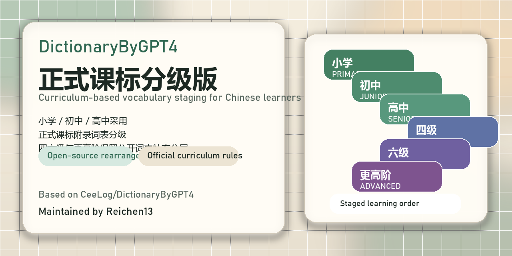

# DictionaryByGPT4 Curriculum Levels

基于正式课标重新分级的开源单词书整理版。



[在线访问（GitHub Pages）](https://reichen13.github.io/DictionaryByGPT4-Curriculum-Levels/)

[句子学习 Demo](https://reichen13.github.io/DictionaryByGPT4-Curriculum-Levels/study.html)

[开发路线图](./ROADMAP.md)

[Superpowers 审视记录](./docs/superpowers-roadmap-review-2026-03-26.md)

## 项目简介

这个仓库保留了原项目的单词内容与展示方式，但把学校阶段分层调整成更符合国内英语学习路径的正式课标分级。

当前分级规则：

- 小学：依据《义务教育英语课程标准（2022年版）》附录词汇
- 初中：依据《义务教育英语课程标准（2022年版）》附录三级词汇
- 高中：依据《普通高中英语课程标准（2017年版2020年修订）》附录 2 带星词汇
- 大学四级 / 大学六级 / 更高阶：继续使用公开词表作为补充分层

## 这个版本做了什么

- 把单词页面调整为按学习阶段顺序浏览，而不是单纯按字母顺序浏览
- 为小学、初中、高中分别接入正式课标词表
- 生成新的分级结果文件 `word_levels.json`
- 保留原项目的单词释义内容、JSON 数据、MDX / EPUB / PDF 文件

## 主要文件

- [index.html](./index.html)：分级后的网页版本
- [word_levels.json](./word_levels.json)：单词到分级的映射结果
- [gptwords.json](./gptwords.json)：原始单词内容数据
- [lessons](./lessons)：学习页 lesson 源数据目录
- [scripts/import_lessons.py](./scripts/import_lessons.py)：从 lesson 源文件生成学习页数据与媒体
- [scripts/build_leveled_index.py](./scripts/build_leveled_index.py)：页面生成脚本
- [scripts/extract_official_curriculum_vocab.py](./scripts/extract_official_curriculum_vocab.py)：义务教育阶段词表提取脚本
- [scripts/extract_official_senior_high_vocab.py](./scripts/extract_official_senior_high_vocab.py)：高中阶段词表提取脚本

## 如何重新生成

```bash
python scripts/extract_official_curriculum_vocab.py
python scripts/extract_official_senior_high_vocab.py
python scripts/build_leveled_index.py
python scripts/import_lessons.py
```

## 如何使用

如果只是本地浏览，直接打开 [index.html](./index.html) 即可。

如果是 GitHub Pages 部署，仓库根目录的 `index.html` 就是站点入口。

如果要体验“课标分级 + 视频句子学习”的简化版，请打开 [study.html](./study.html)。

当前 demo 已包含：

- 基于 `lessons/*/lesson.json` 的 lesson 导入链路
- 支持 `manual`、`csv-import` 和 `srt-import` 三种 lesson 源格式
- 本地 lesson 视频播放
- 逐句定位与单句循环
- 预生成句子音频
- 可切换的浏览器 TTS 语音
- 右侧点词查看分级
- 生词本收藏

当前示例 lesson：

- 小学 3 节
- 初中 3 节
- 高中 3 节
- 四级 1 节

lesson 源格式补充：

- `manual`：直接在 `lesson.json` 里写 `sentences`
- `csv-import`：在 `lesson.json` 中声明 `source.type = "csv-import"` 和 `source.file`
- `srt-import`：在 `lesson.json` 中声明 `source.type = "srt-import"`、`source.enFile`、`source.zhFile`
- 当前 CSV 至少支持列：`id,en,zh`
- 可选 CSV 列：`start,end,audio,tokens,notes`
- 当前 SRT 采用中英双文件配对导入，并使用英文字幕的时间轴

当前开发状态：

- 词书主站已经是可长期使用的正式课标分级版
- 学习页已经完成最小可用 Demo
- 下一阶段建议优先建设 lesson 导入和内容生产链，详见 [ROADMAP.md](./ROADMAP.md)

如果在本地直接双击 HTML 文件时遇到数据加载问题，请启动一个静态服务器再访问，例如：

```bash
python -m http.server 8000
```

## 来源与致谢

本仓库基于原项目 [CeeLog/DictionaryByGPT4](https://github.com/Ceelog/DictionaryByGPT4) 做了分级整理与页面重排。

感谢原作者 @CeeLog 的开源。原始单词内容主体来自原项目，这个仓库只做了较小范围的结构性改动，没有改变原项目的核心内容生产工作。

## 许可证

沿用原仓库许可证，见 [LICENSE](./LICENSE)。
